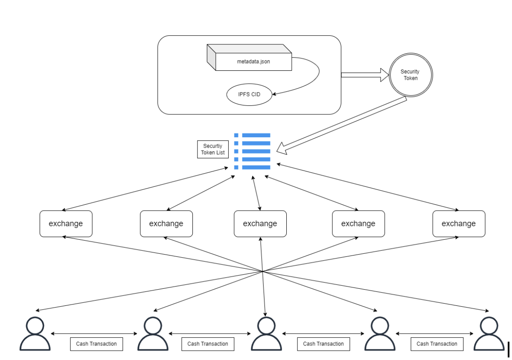

# COTC(Crypto over the counter)

[whitePaper](https://docs.google.com/document/d/13kr5SESbG5O65iSWzklvH6WWqcYMOPCs3s379kf9gto/edit)  
[demo](https://front-8obhirfnn-decent-trio.vercel.app/)

## introduction

COTC (Crypto Over The Counter) introduces an innovative approach to trading over-the-counter (OTC) stocks using blockchain technology. Our solution enables OTC stock trading without the need for intermediary institutions. Decentralized intermediaries can share uniform pricing information and facilitate the trading of OTC stocks through a unified network.

Our vision is to provide a platform that allows the issuance and trading of real-world assets in the form of tokens, starting from OTC stocks to tokenized securities. Through this, we aim to reduce the complexity and costs associated with intermediary institutions in the traditional OTC stock market, while realizing more efficient and transparent transactions through a decentralized network.  

## Demo walkThrough

1. you need metamask installed before using our app

2. you need to connect with KLAYTN BAOBOB network in order to interact with smartcontract we deployed (chainID:1001)

##### we require you to type your private key before triggering smart contract, since we didn't implemented any tool to protect your key, we recommend using new wallet with no assets.

3. go to Profile Claim for PUSD. PUSD is Peseudo Stable coin we implemeted, which we assumed it values 1$.

4. browse the website, choose any STO you feel like to buy.

5. see the orders listed on orderBook rendering, type quantity and price of order, hit the button

6. you'll see contract left on your prompt, which represent electronic contract that you agreed to trade the token.

7. type out your private key on the space right side, than you can trigger orderbook smart contract and list your order on chain.
